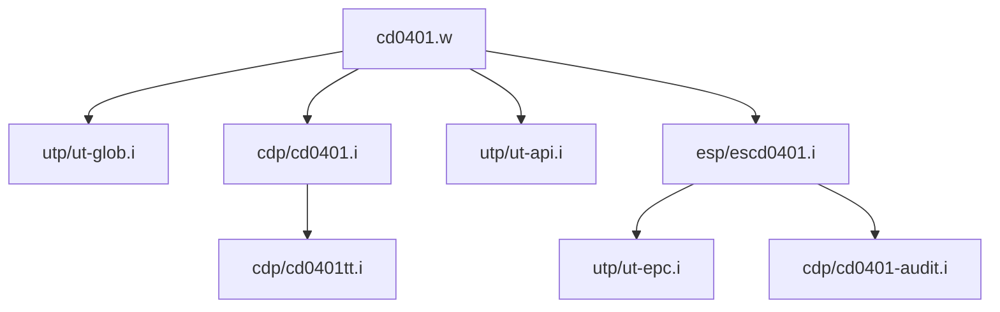

# Rastreador de Includes Recursivo (Include Tree Explorer)

Esta skill permite inspecionar profundamente fontes Progress ABL (`.p`, `.w`, `.cls`, `.i`), expandindo todas as diretivas de pré-processamento `{include.i}` em múltiplos níveis de profundidade, rastreando argumentos passados e garantindo que nenhum include fique de fora em deploys ou análises de impacto.

---

## 1. Padrões de Diretivas de Include no Progress ABL

O pré-processador do OpenEdge suporta diversas formas de inclusão de arquivos:

1. **Include Direto:**
   ```progress
   {utp/ut-glob.i}
   {cdp/cd0401.i}
   ```
2. **Include com Parâmetros Nomeados:**
   ```progress
   {include/i-epc.i &Program="cd0401" &Event="AFTER-SAVE"}
   ```
3. **Include com Parâmetros Posicionais:**
   ```progress
   {method/db-find.i "tt-item" "item.it-codigo" "input-codigo"}
   ```
4. **Include Dinâmico / Definido por Pré-processador:**
   ```progress
   &GLOBAL-DEFINE IncName "cd0401a.i"
   {{&IncName}}
   ```

---

## 2. Processo de Mapeamento Recursivo

Ao analisar um arquivo fonte, siga os seguintes passos rigorosos:

### Passo 1: Busca por Diretivas de Abertura
Identifique no texto todas as ocorrências de regex que representam includes:
```regex
\{([a-zA-Z0-9_\-\.\/\\]+\.[iI])(\s+[^}]+)?\}
```

### Passo 2: Resolução de Caminhos via PROPATH
Para cada include encontrado:
1. Verifique se o caminho é relativo ao diretório do arquivo atual.
2. Caso não seja encontrado localmente, procure nas pastas do PROPATH do projeto (ex: `src/`, `includes/`, `esp/`, `utp/`, etc.).
3. Registre o status de resolução:
   - `[ENCONTRADO]` Caminho absoluto resolvido no disco.
   - `[NÃO ENCONTRADO]` Include pertencente ao produto padrão TOTVS Datasul não disponível no repositório local.

### Passo 3: Prevenção de Loops Circulares
Mantenha uma pilha de chamadas (`callStack`). Se o arquivo `A.i` inclui `B.i` e `B.i` inclui `A.i`, interrompa a recursão no nó circular e emita um alerta visual:
```
⚠️ LOOP CIRCULAR DETECTADO: A.i → B.i → A.i
```

### Passo 4: Extração de Parâmetros
Documente quais parâmetros foram passados na diretiva (`&param=valor` ou `{1}`) e onde são substituídos no corpo do include.

---

## 3. Formatos de Saída

### Formato 1: Árvore Textual Hierárquica
```text
📦 cd0401.w (Fonte Principal)
 ├── 📄 utp/ut-glob.i (Definições Globais de Sessão)
 ├── 📄 cdp/cd0401.i (Definição de Temp-Tables tt-item)
 │    └── 📄 cdp/cd0401tt.i (Definição de Buffers adicionais)
 ├── 📄 utp/ut-api.i (API de Comunicação com PASOE)
 └── 📄 esp/escd0401.i (Regras de Negócio do Cliente)
      ├── 📄 utp/ut-epc.i (&Event="VALIDA-ITEM")
      └── 📄 cdp/cd0401-audit.i (Auditoria de Alterações)
```

### Formato 2: Diagrama Mermaid


### Formato 3: Lista Plana de Arquivos para Pacote de Deploy
Exporta a lista única de todos os arquivos necessários para compilar o programa em uma máquina ou ambiente limpo:
- `cd0401.w`
- `utp/ut-glob.i`
- `cdp/cd0401.i`
- `cdp/cd0401tt.i`
- `utp/ut-api.i`
- `esp/escd0401.i`
- `cdp/cd0401-audit.i`
